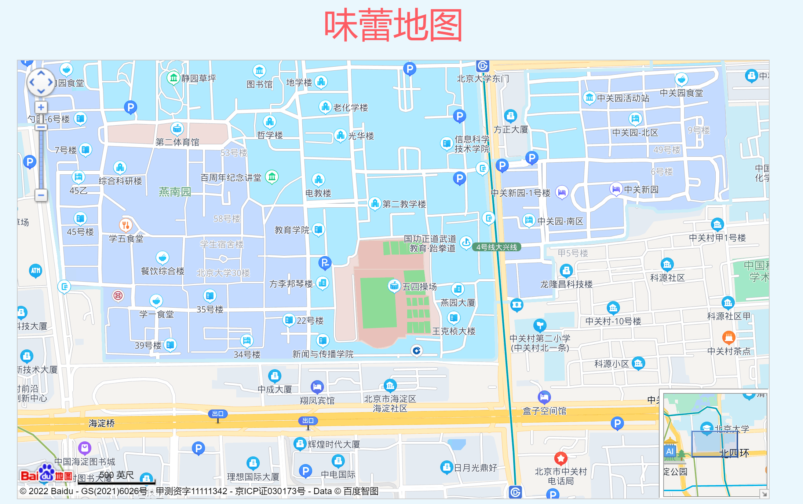
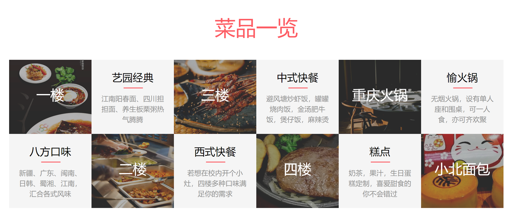
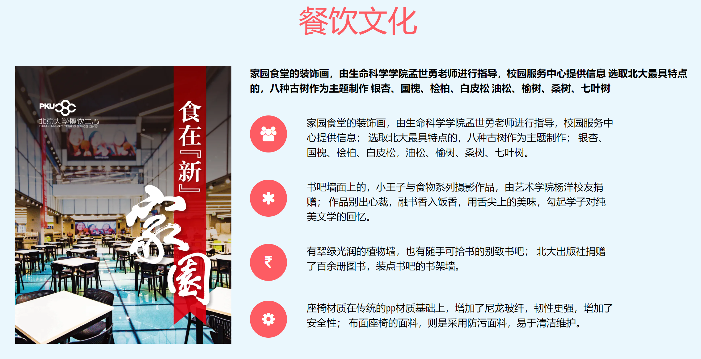

## Peking University Canteen Web Design

**JavaScript and Html Web Pages 2021 Final Project**

#### Demo

For **full 6 pages** on the website, download all files and click on "index.html"

#### Project Description

##### Home Page

1. When the PKU Canteen icon in the upper left corner is hovered, the transition turns red.
2. Click each icon in the upper right corner to enter the corresponding html.
3. When refreshing the home page, the main title, subtitle, and three pictures of "Eat·In Peking University" will be drawn up one by one and appear.
The main title, subtitle, and three pictures can all be hovered. After hovering, they will be enlarged and trigger the overall size change. When hovering an image, the brightness of the image will also increase.
4. In the "Food Map" section, we register on the Baidu Map API, and call and set the location on the Internet.
5. In the "Food Collection" section, each part calls bootstrap card, which is compatible and more beautiful and easy to scale.
The image hover in each card will be enlarged, a box-shadow will appear, and the entire box will move up to highlight.
6. Footer contains links to the corresponding html, and a Copyright section.

##### Jiayuan Canteen

1. The introduction of the main food, dessert and service appears above. Use border-radius to set it to a circle, and set the border to white.
2. "List of dishes": Introduce samples of different cafeterias.
In order to achieve good results, we not only screened the best pictures for each canteen separately, but also divided the interesting restaurants on the fourth floor separately.
Moreover, each picture has undergone meticulous darkening preprocessing (the brightness of these pictures has been reduced compared to normal pictures with picture editing software), so that the texts such as "first floor" and "second floor" can be distinguished from the background pictures.
Text such as "first floor", "second floor", etc., uses transition to display a box during hover to enhance interaction.
3. "Catering culture": The collected beautiful logo of Peking University Dining Center is used as the left image, and then the right side introduces the history and culture of Peking University integrated in the dining hall.
4. "Features of the cafeteria": Finally, we introduce some interesting points of the new cafeteria. Because the new cafeteria is very interesting and modern, we combined with gif images to further enhance the effect.

##### Nongyuan Canteen

1. The header part has the logo of PKU's Canteen: you can jump to the home page. Icons such as "Home" and "Home" on the right can also jump to the corresponding page.
2. The Nongyuan Canteen container is mainly divided into three sections. They are "Light Food Package", "Student Evaluation" and "More Dishes".
3. The "Light Food Package" section introduces a new package from the farm; when the page is full-screen, the pictures and introduction are distributed left and right, the page width is reduced, and it is automatically adjusted to the upper and lower distribution; it is more flexible and beautiful.
4. "Student Evaluation" intercepts the evaluations of some students who dine in Beidashudong on the farm dishes. The background image is appropriately scaled with the width of the page; the comment adopts the ul/li structure, and the page will be reduced from two columns to one column when it is reduced to a certain extent.
5. The "More dishes" section captures some dishes in the farm, and the pictures will also scale with the page size.
6. The link in the footer section can jump to other canteens.

##### Shaoyuan Canteens

1. The introduction of Shaoyuan Restaurant is divided into: banner, menu and footer. The banner and footer are the same as above.
2. The menu part introduces the special dishes of Shaoyuan Chinese Restaurant and Shaoyuan Western Restaurant.

##### News

1. "Latest News" is made with the card of the boostrap frame. Xiangyun banner is made by ourselves. The text and pictures of Yanyuan Cakes adopt a grid system, which makes the whole thing more simple and beautiful.
2. The "Did you know" part uses js-counter to do a counting effect.
3. A button to return to the main page is set in the lower right corner of the page, and SmoothScroll.js is used to make the page slide more smooth. The whole page uses animate.css to make each module have the effect of Fade In, and uses main.js to control the trigger time of the animation, so that the user slides to the page to trigger the animation effect of the module on the current page.

##### Contact us

1. The town floor map adopts data-stellar, so that when the page goes down, the picture will remain relatively static.
The meal schedule uses striped tables and is aligned. The telephone numbers and email addresses of the contact information are hyperlinked, so that users can make calls and send emails with one click.
2. A button to return to the main page is set in the lower right corner of the page, and SmoothScroll.js is used to make the page slide more smooth.
The whole page uses animate.css to make each module have the effect of Fade In, and uses main.js to control the trigger time of the animation, so that the user slides to the page to trigger the animation effect of the module on the current page.

#### Known Bugs

In IE lower version browsers, sometimes there is a bug when sliding down.

#### Copyright

All the pictures/GIFs used are real scenes of the canteen of Peking University.

#### Teamwork

Zhilang Yang: Looked for templates; "News" and "Contact" pages.

Kangyi Qiu: "Nongyuan" and "Shaoyuan" pages.

Haoxiang Yang: Team leader; Proposed idea; "Home", "Jiayuan" pages and final integration; make demos.

